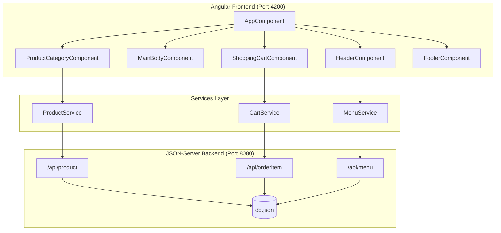

# Final E-commerce Project Diagram

## Visual Diagram (Mermaid)



## Architecture Overview

```
┌─────────────────────────────────────────────────────────────┐
│                    Angular Frontend (Port 4200)              │
├─────────────────────────────────────────────────────────────┤
│                                                              │
│  ┌──────────────┐                                           │
│  │  AppComponent│                                           │
│  └──────┬───────┘                                           │
│         │                                                    │
│    ┌────┴────┬──────────┬──────────┬──────────┐            │
│    │         │          │          │          │            │
│  ┌─▼──┐  ┌──▼───┐  ┌───▼──┐  ┌───▼──┐  ┌───▼──┐          │
│  │Header│  │Main │  │Product│  │Cart │  │Footer│          │
│  │      │  │Body │  │Category│  │     │  │      │          │
│  └──┬───┘  └─────┘  └───┬───┘  └───┬──┘  └──────┘          │
│     │                    │          │                       │
│  ┌──▼──┐              ┌──▼──┐   ┌──▼──┐                  │
│  │Nav  │              │View │   │Cart │                   │
│  │Menu │              │Modal│   │Table│                   │
│  └─────┘              └─────┘   └─────┘                   │
│                                                              │
└─────────────────────────────────────────────────────────────┘
         │              │              │
         │              │              │
    ┌────▼────┐    ┌────▼────┐    ┌────▼────┐
    │ Menu    │    │ Product │    │  Cart   │
    │ Service │    │ Service │    │ Service │
    └────┬────┘    └────┬────┘    └────┬────┘
         │              │              │
         └──────────────┴──────────────┘
                       │
                  ┌────▼─────┐
                  │  HTTP    │
                  │  Client  │
                  └────┬─────┘
                       │
┌──────────────────────▼──────────────────────────────────────┐
│              JSON-Server Backend (Port 8080)                  │
├──────────────────────────────────────────────────────────────┤
│                                                               │
│  ┌──────────────┐  ┌──────────────┐  ┌──────────────┐      │
│  │  /api/product│  │/api/orderitem│  │  /api/menu  │      │
│  │              │  │              │  │             │      │
│  │  GET         │  │  GET         │  │  GET        │      │
│  │  (fallback)  │  │  POST        │  │  (fallback) │      │
│  │              │  │  PUT         │  │             │      │
│  │              │  │  DELETE     │  │             │      │
│  └──────┬───────┘  └──────┬───────┘  └──────┬──────┘      │
│         │                 │                 │              │
│  ┌──────▼──────┐  ┌──────▼──────┐  ┌──────▼──────┐      │
│  │   db.json   │  │   db.json    │  │   db.json   │      │
│  │  product[]  │  │ orderitem[]  │  │   menu[]    │      │
│  └─────────────┘  └──────────────┘  └─────────────┘      │
│                                                               │
└───────────────────────────────────────────────────────────────┘
```

## Component Hierarchy

```
AppComponent
├── HeaderComponent
│   ├── Logo (scents_logo.png)
│   └── Navigation Bar
│       ├── Home
│       ├── Gallery
│       ├── Products
│       ├── Cart
│       ├── Customer
│       └── Contact Us
│
├── Router Outlet
│   ├── MainBodyComponent (Home)
│   │   ├── Hero Banner
│   │   ├── Brand Philosophy
│   │   └── Collection Story
│   │
│   ├── ProductCategoryComponent (Products)
│   │   ├── Product Grid
│   │   └── Product Modal
│   │
│   ├── ShoppingCartComponent (Cart)
│   │   ├── Cart Table
│   │   ├── Quantity Controls
│   │   ├── Remove Item
│   │   ├── Checkout Modal
│   │   └── Thank You Modal
│   │
│   ├── GalleryComponent
│   ├── ContactUsComponent
│   └── CustomerServiceComponent
│
└── FooterComponent
    ├── About Section
    └── Newsletter Form
```

## Data Flow

```
User Action Flow:
─────────────────

1. VIEW PRODUCTS
   User → ProductCategoryComponent
         ↓
         ProductService.getData()
         ↓
         Backend API (/api/product)
         ↓
         Display Products

2. ADD TO CART
   User → ProductCategoryComponent
         ↓
         CartService.addToCart(item)
         ↓
         POST /api/orderitem
         ↓
         Navigate to Cart

3. VIEW CART
   User → ShoppingCartComponent
         ↓
         CartService.getCart(customerId)
         ↓
         GET /orderitem?customerId=1&status=0
         ↓
         Display Cart Items

4. UPDATE QUANTITY
   User → ShoppingCartComponent
         ↓
         CartService.updateCartItem(item)
         ↓
         PUT /orderitem/{id}
         ↓
         Reload Cart

5. REMOVE ITEM
   User → ShoppingCartComponent
         ↓
         CartService.deleteItem(id)
         ↓
         DELETE /orderitem/{id}
         ↓
         Reload Cart
```

## Services & Models

```
Services:
─────────
┌─────────────────┐
│  MenuService    │ → GET /api/menu (fallback to local menu)
└─────────────────┘

┌─────────────────┐
│ ProductService  │ → GET /api/product (fallback to local products)
└─────────────────┘

┌─────────────────┐
│  CartService    │ → GET /orderitem?customerId=X&status=0
│                 │ → POST /api/orderitem
│                 │ → PUT /orderitem/{id}
│                 │ → DELETE /orderitem/{id}
└─────────────────┘

Models:
───────
┌──────────────┐
│    Menu     │
│ - id        │
│ - name      │
│ - routerPath│
└──────────────┘

┌──────────────┐
│   Product    │
│ - id         │
│ - name       │
│ - price      │
│ - imageFile  │
│ - description│
└──────────────┘

┌──────────────┐
│ProductCategory│
│ - categoryName│
│ - products[]  │
└──────────────┘
```

## Key Features

```
FEATURES:
─────────

1. 🏠 Homepage
   - Hero banner with single image
   - Brand philosophy section
   - Collection story

2. 🛍️ Products
   - Product catalog display
   - Product modal with zoom
   - Add to cart functionality

3. 🛒 Shopping Cart
   - View cart items
   - Update quantities
   - Remove items
   - Clear cart
   - Checkout process

4. 🎨 Navigation
   - Responsive navbar
   - Active route highlighting
   - Smooth hover effects

5. 📱 Responsive Design
   - Mobile-friendly layout
   - Adaptive components
```

## File Structure

```
finalecom/
├── src/
│   ├── app/
│   │   ├── components/
│   │   │   ├── header/
│   │   │   ├── footer/
│   │   │   ├── main-body/
│   │   │   ├── product-category/
│   │   │   └── shopping-cart/
│   │   │
│   │   ├── services/
│   │   │   ├── cart.service.ts
│   │   │   ├── product.service.ts
│   │   │   └── menu.service.ts
│   │   │
│   │   └── models/
│   │       ├── product.ts
│   │       └── product-category.ts
│   │
│   └── assets/
│       └── products/
│
├── db.json          (Mock database)
├── routes.json      (API route mapping)
└── package.json     (Dependencies & scripts)
```

## Technology Stack

```
Frontend:
  - Angular 20.3
  - TypeScript
  - RxJS
  - CSS3

Backend:
  - JSON-Server (Mock API)
  - Node.js

Styling:
  - Custom CSS
  - Responsive Design
  - CSS Variables (Theme)
```

